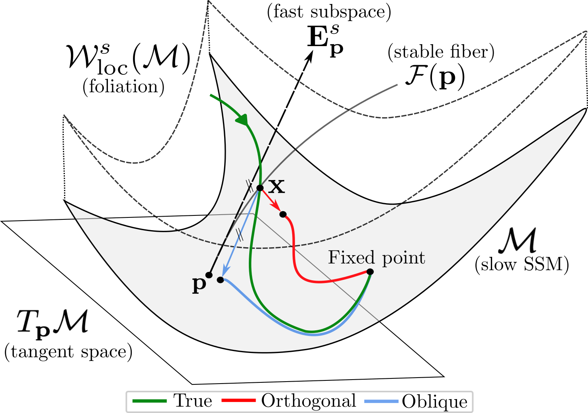

# Opt-SSM 🤖 🚀

This codebase accompanies the paper *Taming High-Dimensional Dynamics: Learning Optimal Projections onto Spectral Submanifolds*.



## Installation

It is recommended to work in a virtual environment.
Use the package manager [pip](https://pip.pypa.io/en/stable/) to install Opt-SSM:

```bash
pip install -r requirements.txt
```

## Usage
Example usage of the OptSSM class:

```python
from utils.ssm import OptSSM

opt_ssm = OptSSM(aut_trajs_obs=aut_trajs_obs,
                 t_split=3.5,
                 SSMDim=5,
                 SSMOrder=2,
                 ROMOrder=2,
                 N_delay=3,
                 ts=ts,
                 verbose=True)
```


## License

This project is licensed under the MIT License - see the [LICENSE](LICENSE) file for details

## Acknowledgments

* We thank the authors of the package [SSMLearnPy](https://github.com/haller-group/SSMLearnPy)
* The slow-fast and simplified fluid benchmarks are adopted from *[Learning nonlinear projections for reduced-order modeling of dynamical systems using constrained autoencoders](https://pubs.aip.org/aip/cha/article/33/11/113130/2923554)*

## Citation
```
@article{buurmeijere2025optssm,
      author = {Buurmeijer, Hugo and  and Pavone, Marco},
      title = {Taming High-Dimensional Dynamics: Learning Optimal Projections onto Spectral Submanifolds},
      year = {2025},
      journal = {arXiv preprint arXiv:2504.03157},
      note = {Submitted to IEEE Conference on Decision and Control (CDC), Rio de Janeiro, 2025},
      }
```
